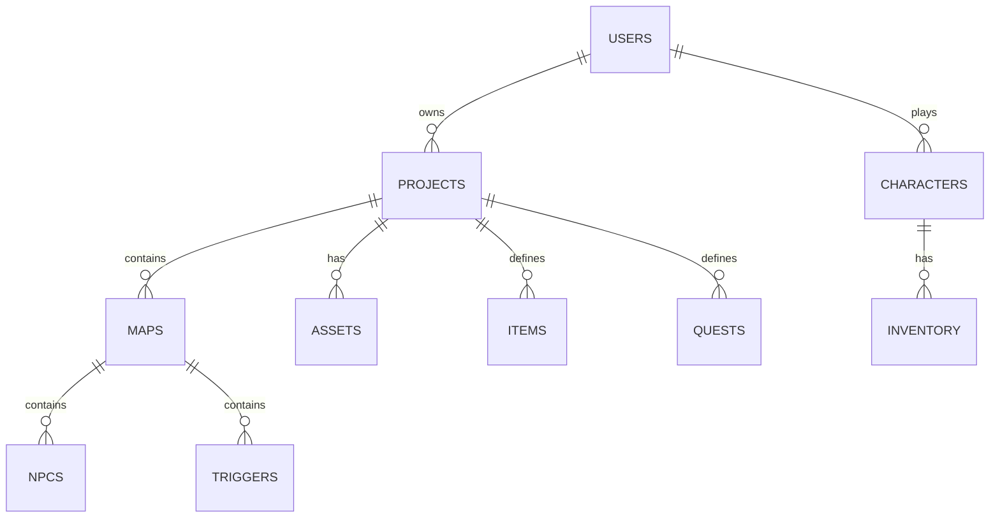

# **Bitrealm**

*formerly “PixelForge” – name updated*
**Browser-native, plugin-ready, open-source MMORPG builder**
**Product Requirements Document (PRD)** · **v2.0** · *June 2025*

---

## 1 · Vision

Enable anyone with a browser to **design, publish, and run fully-featured pixel-art MMORPGs**—no proprietary engines, no installs, no vendor lock-in.
A single, horizontally-scalable cluster delivers REST **and** real-time play for every player-made “game server.”
Designers get drag-and-drop tools *plus* a lightweight DSL; players join instantly from a link.

---

## 2 · Goals & Success Metrics

| Goal                   | KPI                                                          |
| ---------------------- | ------------------------------------------------------------ |
| Ship MVP ≤ 4 months    | Dog-foodable alpha by week 12                                |
| Lower barrier to entry | 80 % of closed-beta creators ship a playable map in < 30 min |
| Scalable by default    | ≥ 5 000 CCU per physical node before auto-scale              |
| OSS-friendly           | 100 % AGPL/BSD/MIT stack; monorepo public day 1              |
| Monetisation-ready     | Stripe tip-jar & optional Patreon link per world             |

---

## 3 · Personas

* **Pixel Tinkerer** – hobbyist, 17 y/o, wants a retro world with zero code.
* **Systems Designer** – loves scripting & balance tuning.
* **Streamer / Community Host** – private shards for patrons.
* **Small-Team Mapper** – two-to-five friends co-editing regions.
* **Live GM** – runs weekend raids & live events.
* **Player** – click link, play on laptop or phone.

---

## 4 · Core Feature Matrix

| Area                  | Must-Have                                                 | Nice-to-Have (post-MVP)     |
| --------------------- | --------------------------------------------------------- | --------------------------- |
| **Asset Library**     | Upload CC-0 spritesheets • AI-generate                    | Marketplace / revenue-share |
| **Map Builder**       | Tile editor, bulk paint, collision, portals               | Procedural terrain brush    |
| **NPC & Dialogue**    | Static branches or GPT chat                               | Voice synth                 |
| **Quest Designer**    | Kill / fetch / waypoint templates                         | Branching chains UI         |
| **Combat & Stats**    | JSON “stat-block”, damage calc                            | Status effects              |
| **Inventory & Items** | Icons, slot rules, equip effects                          | Cosmetic skins              |
| **Audio**             | Zone BGM loop, positional SFX, triggers                   | Real-time spatial mixer     |
| **Game Logic DSL**    | Event-driven, YAML-ish, hot-reload                        | Visual flowchart            |
| **Real-time Engine**  | 60 FPS PixiJS client • Colyseus rooms                     | Server-side rollback        |
| **Player Services**   | OAuth (GitHub, Google, Discord) • chat • friends • shards | Guilds, mail                |
| **Publish Flow**      | One-click Public, vanity URL, embed code                  | Version pinning & rollbacks |
| **Admin & Ops**       | Dashboard, logs, metrics, ban/kick                        | Auto-scaling rules UI       |
| **Plugins** (NEW)     | Drop-in JS folders, hot-reload                            | Public plugin marketplace   |

---

## 5 · Information Architecture & Pages

| Section                         | Key Components                                                        |
| ------------------------------- | --------------------------------------------------------------------- |
| **Landing**                     | Hero demo • “Make a Game” CTA • showcase carousel                     |
| **Auth**                        | Sign-up / SSO • profile & avatar                                      |
| **Dashboard**                   | Project cards (name, CCU) • “New Project”                             |
| **Project › Overview**          | Title • description • public toggle • player cap                      |
| **Project › Assets**            | Spritesheets • Tilesets • Audio • Fonts • AI-generate                 |
| **Project › Map Editor**        | PixiJS canvas • layer list • palette • collision toggle • portal tool |
| **Project › NPCs & Dialogue**   | NPC list • sprite picker • dialogue tree • “Dynamic (AI)” check       |
| **Project › Items & Inventory** | Item table • icon picker • JSON stat editor                           |
| **Project › Quests**            | Quest list • template wizard • reward picker                          |
| **Project › Logic (Script)**    | DSL editor (Monaco) • docs sidebar                                    |
| **Project › Audio**             | Zone list • BGM drop • trigger overlay                                |
| **Project › Test Play**         | Live iframe vs staging room                                           |
| **Project › Publish**           | Version notes • public URL • share buttons                            |
| **Game Page**                   | Play button • ratings • tip jar • changelog • CCU                     |
| **In-Game Client**              | Canvas • chat • hotbar • minimap • inventory • quest log              |
| **Admin Console**               | Live logs • players • ban/kick • metrics                              |

---

## 6 · Tech Stack & Deployment  *(TypeScript removed — JS + JSDoc everywhere)*

| Layer             | Choice                                    | Rationale                  |
| ----------------- | ----------------------------------------- | -------------------------- |
| **Frontend**      | Vue 3 + Vite + Pinia (ES Modules)         | Small bundles, fast HMR    |
| **Rendering**     | PixiJS 8                                  | WebGL2, perfect 2-D pixels |
| **Real-time**     | Colyseus (Node JS)                        | Room-based MMO server      |
| **REST & Auth**   | Fastify v4 + tRPC (JS)                    | Lean, schema-driven        |
| **DB**            | PostgreSQL + node-pg + SQL templates      | Zero TS generics           |
| **Asset Storage** | S3-compatible (e.g., MinIO)               | Cloud or self-host         |
| **Message Queue** | Redis pub/sub                             | Sticky-session adapter     |
| **Validation**    | JSON Schema → Zod runtime                 | Compile-free               |
| **AI Services**   | OpenAI / Local SDXL via Docker            | Optional plugin            |
| **Container**     | Docker-compose (dev) • Helm/Fly.io (prod) | k8s-ready                  |
| **CI/CD**         | GitHub Actions → Docker registry          | Zero-downtime deploys      |
| **Observability** | Prometheus • Grafana • Loki               | OSS & horizontal           |

*Single-node dev:* `docker compose up`
*Prod scale:* Colyseus rooms behind sticky LB, stateless REST pods auto-scale, Redis & Postgres HA.

---

## 7 · Domain-Specific Language (DSL)

### 7.1 Grammar (excerpt)

```ebnf
script       := { event_block } ;
event_block  := 'on' event_name '{' { statement } '}' ;
statement    := assignment | if_stmt | give | warp | emit | wait | script_block ;
script_block := 'script' '{' <JavaScript w/ JSDoc> '}' ;
```

### 7.2 Built-in Events

| Event                    | Fires When              |
| ------------------------ | ----------------------- |
| `playerJoin`             | Player enters map       |
| `npcInteract`            | Player talks            |
| `questComplete`          | Quest ID done           |
| `itemUse`                | Item consumed           |
| `zoneEnter` / `zoneExit` | Region boundary crossed |

### 7.3 Example

```dsl
on playerJoin {
  if (player.level == 1) {
    give player "Wooden Sword" 1;
    emit "chat", "⚔️ $playerName received a Wooden Sword!";
  }
}

on npcInteract {
  if (npc.name == "Mysterious Door") {
    warp player "DungeonEntrance" 5 10;
  }
}
```

*Hot-reload*: editor save → WS diff → live room updates with no kick.

---

## 8 · Plugin System (NEW)

| Hook                                       | Purpose                          |
| ------------------------------------------ | -------------------------------- |
| `extendSchema(entity, jsonSchema)`         | Add fields to map/item/etc.      |
| `onInit`, `onTick`, `onAction`, `onRender` | Runtime callbacks                |
| `registerUI(VueComponent)`                 | Inject panels or toolbar buttons |

> **File rule:** ≤ 1 000 LOC; ESLint `max-lines` enforces.

```js
// plugins/weather/index.js
export function registerPlugin(forge) {
  forge.hooks.extendSchema('map', {
    weather: { type: 'string', enum: ['sun','rain','snow'], default: 'sun' }
  });

  forge.hooks.onTick(({ map, rand }) => {
    if (map.weather === 'rain' && rand() < 0.1) {
      forge.events.emit('spawnFx', { id: 'raindrop', x: rand(), y: rand() });
    }
  });
}
```

*Drop folder → Mythweaver autoloads → appears in “Plugins” tab.*

---

## 9 · API Contract

### 9.1 REST (`/api/v1`)

| Method | Route                    | Body / Params    | Purpose        |
| ------ | ------------------------ | ---------------- | -------------- |
| POST   | `/auth/oauth/:provider`  | code             | OAuth exchange |
| GET    | `/projects`              | —                | List projects  |
| POST   | `/projects`              | `{name}`         | Create project |
| GET    | `/projects/:id`          | —                | Project detail |
| PUT    | `/projects/:id/publish`  | `{versionNotes}` | Publish        |
| POST   | `/assets/:type`          | multipart        | Upload asset   |
| POST   | `/ai/generate/sprite`    | `{prompt}`       | AI sprite      |
| POST   | `/maps/:id`              | TMJ JSON         | Save map       |
| POST   | `/logic/:id`             | DSL text         | Save script    |
| GET    | `/public/:slug/manifest` | —                | World metadata |

### 9.2 WebSocket Namespaces

| Namespace              | → Server                    | ← Server                       |
| ---------------------- | --------------------------- | ------------------------------ |
| `/play/:world/:shard`  | join • move • action • chat | state • chat • pickup • damage |
| `/designer/live/:proj` | saveMap • saveLogic         | ok • error • reloadClients     |

---

## 10 · Data Model (simplified)



---

## 11 · Security & Compliance

* JWT (http-only • same-site=strict)
* Postgres RLS: `owner_id = current_user`
* Rate-limit public APIs; server-side collision to prevent cheats
* GDPR export/delete; COPPA flag disables chat & AI for <13

---

## 12 · Performance & Scalability

* Physics/movement server-auth; client is thin renderer
* Colyseus room cap: 100 CCU → auto spawn new process
* Cold-start target: < 200 ms (pre-warmed containers)
* Assets via Cloudflare R2 CDN
* DSL transpiled to sandboxed JS VM once per room, cached

---

## 13 · Development Experience Rules *(AI-friendly)*

| Rule                   | Tool                           |
| ---------------------- | ------------------------------ |
| ≤ 1 000 LOC per file   | ESLint `max-lines`             |
| Flat import graph      | ESLint `no-restricted-imports` |
| No TypeScript          | CI fails on `.ts`              |
| Schemas in `/schemas/` | jsonschema-lint                |
| Plugin isolation       | Sandbox, public tokens only    |

---

## 14 · Milestones

| Week  | Deliverable                                   |
| ----- | --------------------------------------------- |
| 0-2   | Auth, dashboard shell, PixiJS map canvas      |
| 3-4   | Map editing CRUD, asset upload                |
| 5-6   | DSL parser, visual blocks, single-client test |
| 7-8   | Items, inventory, basic combat                |
| 9-10  | Quest & dialogue tools, DSL v0.9              |
| 11-12 | Publish flow, public hub                      |
| 13    | Closed beta (“Creator Preview”)               |
| 16    | Public MVP launch                             |

---

## 15 · Post-MVP Backlog

* Mobile touch editor
* VRAM-aware texture atlasing
* Live event scheduler (e.g., double-XP)
* Monetisation plugins (cosmetics, ad-free)
* Asset & script marketplace

---

## 16 · Open Questions

1. AI chat quotas for NPCs?
2. Sandbox DSL via SES vs per-worker VM?
3. Content moderation path (OpenAI vs client filter)?
4. Optional on-chain item ownership? (parked)

---

### Appendices

* **A · Example Map-Tile JSON** (unchanged)
* **B · Designer Shortcuts** – `G` Grab • `B` Brush • `C` Collision toggle • `P` Portal • `⌥ + Scroll` zoom

---

**Bitrealm** is now fully specced—ready for Cursor, Claude, or your favourite code genie to scaffold the repo and start shipping. Happy world-building!
